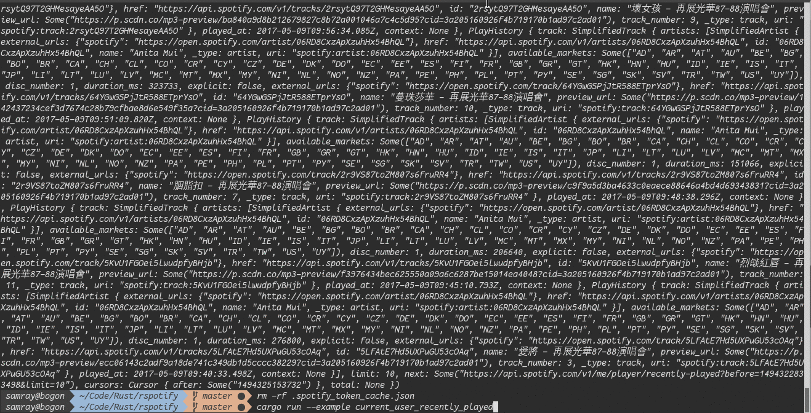

[](https://travis-ci.org/samrayleung/rspotify)

[](https://crates.io/crates/rspotify)
[](https://docs.rs/crate/rspotify/)

# Rspotify - a Rust client for The Spotify Web API 

## Disclaimer

This crate is heavily inspired by [spotipy](https://github.com/plamere/spotipy)- A spotify api wrapper implemented in Python

## Description

Rspotify is a lightweight wrapper for the [Spotify Web API](https://developer.spotify.com/web-api/) It includes helper functions for
**all Spotify's endpoints**, such as fetching metadata (search and look-up of albums, artists, tracks, playlists, new releases) and user's information (follow
users, artists and playlists, and saved tracks management).

## Features

*rspotify* supports all of the features of the Spotify Web API including access to all end points, and support for user authorization, notes that before accessing to any end points, you need to be authorized. For details on the capabilities you are encouraged to review the [Spotify Web Endpoint Reference](https://developer.spotify.com/web-api/endpoint-reference/) documentation.

Nowaday, thanks to [`reqwest`](https://docs.rs/reqwest/0.10.1/reqwest/#proxies), `rspotify` now supports system proxy by default. `Reqwest` System proxies look in environment variables to set HTTP or HTTPS proxies. `HTTP_PROXY` or `http_proxy` provide http proxies for http connections while `HTTPS_PROXY` or `https_proxy` provide HTTPS proxies for HTTPS connections.(~~Notes that `reqwest` system proxy doesn't support socks proxy for now,~~ check [this issue](https://github.com/seanmonstar/reqwest/issues/790) for more details)

## Installation

``` shell
cargo install rspotify
```

Or you could get it from [github](https://github.com/samrayleung/rspotify)

## Getting Started

### Authorization

Since all methods require user authorization now, you will need to generate an authorization token that indicates that the user has granted permission for your application to perform the given task.  You will need to register your app to get the credentials necessary to make authorized calls.

Even if your script does not have an accessible URL you need to specify one when registering your application where the spotify authentication API will redirect to after successful login. The URL doesn't need to work or be accessible, you can specify "http://localhost/", after successful login you just need to copy the "http://localhost/?code=..." URL from your browser and paste it to the console where your application is running. For example:


In order to help other developers to get used to `rspotify`, I registerd a Spotify account with temporary email. Your guys could test `rspotify` with this account's `CLIENT_ID` and `CLIENT_SECRET`, check [.env file](./.env) for more details.

## Examples

If you have a use case you are interested in, you could check the
[examples](./examples), which has all kinds of detailed examples. For example,
If you want to get recently played history, you could check
[current_user_recently_played](./examples/current_user_recently_played.rs). This is
the example code:

``` rust
extern crate rspotify;

use rspotify::spotify::client::Spotify;
use rspotify::spotify::util::get_token;
use rspotify::spotify::oauth2::{SpotifyClientCredentials, SpotifyOAuth};

fn main() {
    // Set client_id and client_secret in .env file or
    // export CLIENT_ID="your client_id"
    // export CLIENT_SECRET="secret"
    // export REDIRECT_URI=your-direct-uri

    // Or set client_id, client_secret,redirect_uri explictly
    // let oauth = SpotifyOAuth::default()
    //     .client_id("this-is-my-client-id")
    //     .client_secret("this-is-my-client-secret")
    //     .redirect_uri("http://localhost:8888/callback")
    //     .build();

    let mut oauth = SpotifyOAuth::default()
        .scope("user-read-recently-played")
        .build();
    match get_token(&mut oauth) {
        Some(token_info) => {
            let client_credential = SpotifyClientCredentials::default()
                .token_info(token_info)
                .build();
            // Or set client_id and client_secret explictly
            // let client_credential = SpotifyClientCredentials::default()
            //     .client_id("this-is-my-client-id")
            //     .client_secret("this-is-my-client-secret")
            //     .build();
            let spotify = Spotify::default()
                .client_credentials_manager(client_credential)
                .build();
            let history = spotify.current_user_recently_played(10);
            println!("{:?}", history);
        }
        None => println!("auth failed"),
    };
}

```

### API Documentation

For more API information, you could check [rspotify Api documentation](https://docs.rs/crate/rspotify)

### CHANGELOG

Please see the [CHANGELOG](./CHANGELOG.md) for a release history.

### Contribution

If you find any problem or have suggestions about this crate, please submit an
issue. Moreover, any pull request ,code review and feedback are welcome.

### License

[MIT](./LICENSE)
